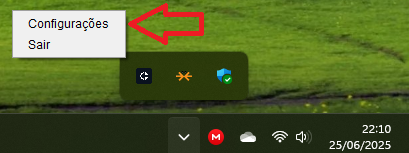
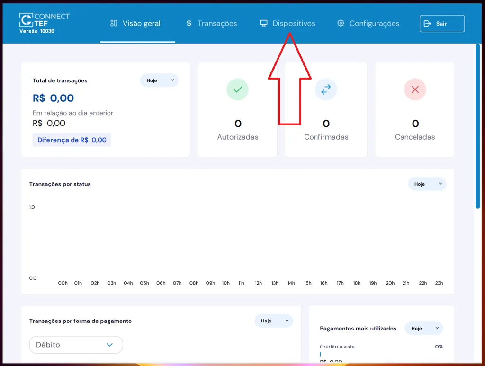
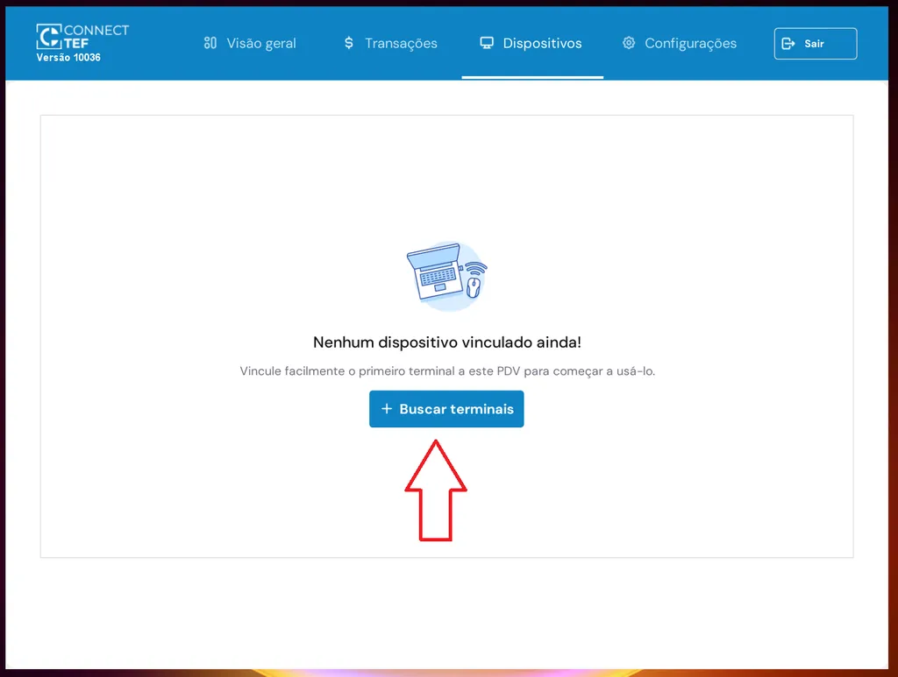
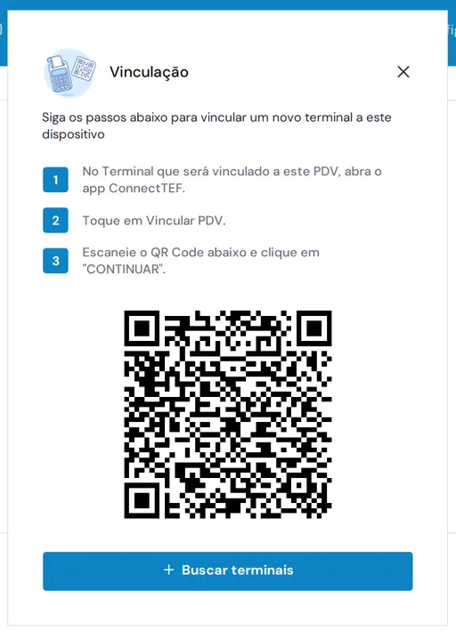
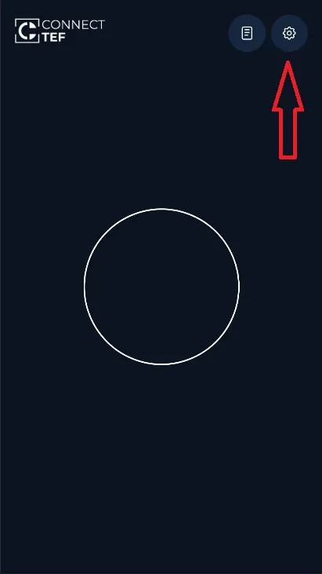
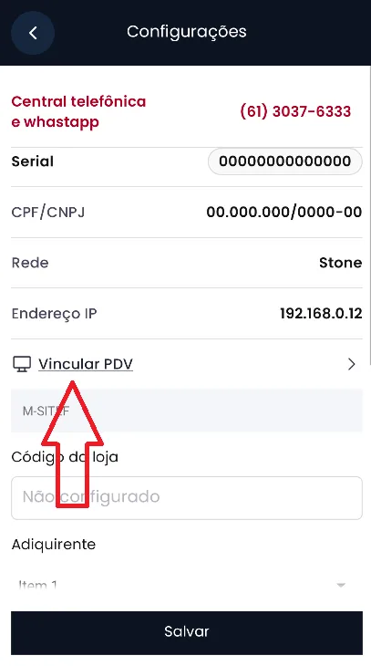
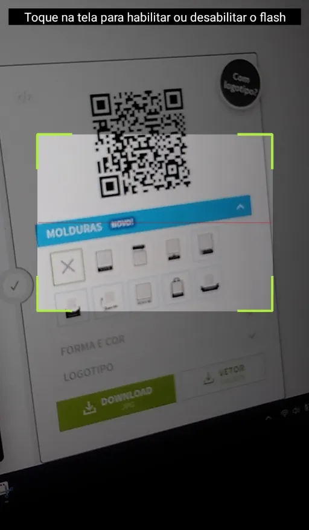
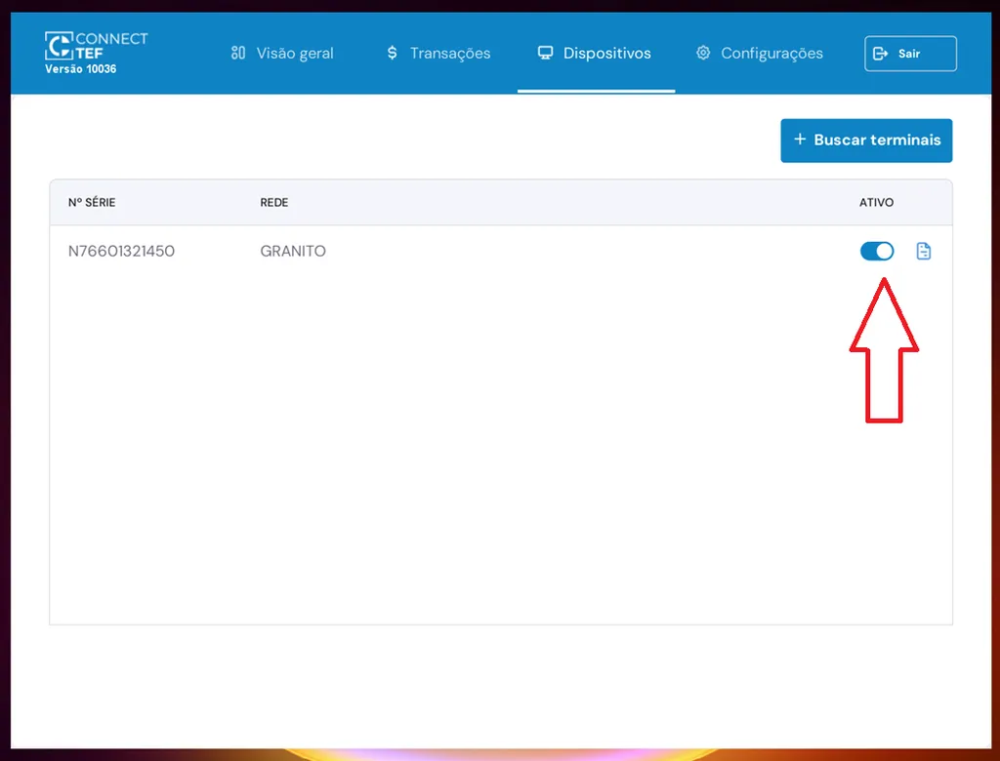

### Passo 1: Acessar o Gerenciador Padrão:
1. **Dê um clique duplo no ícone do Connect TEF na área de trabalho** para iniciá-lo.
2. Em seguida, vá até a **bandeja do sistema**, clique com o botão direito no ícone do Connect TEF e selecione **"Configurações"**.

 

### Passo 2: Clique na aba Dispositivos

### Passo 3: Clique em **Buscar terminais**

- **Um QR Code será exibido na tela:**

### Passo 4: **Abra o aplicativo Connect TEF na maquininha de cartão Smart POS e escaneie o QR Code exibido na tela do computador**

> 🔒 *Se o aplicativo ainda não estiver ativado na maquininha, a leitura do QR Code não será possível.*
> 👉 Consulte a [**documentação de ativação do aplicativo**](../guia-ativacao/smartpos.md) para realizar esse processo antes de continuar.

No Smart POS:

- Abra o app `connecttef`
- Toque no ícone de **Configurações** (⚙️)

- Toque em **Vincular PDV**

- Aponte a câmera para o QR Code exibido no computador

Após leitura bem-sucedida:

- O terminal aparecerá na lista do Connect TEF
- Ative o **switch** para concluir a vinculação

---

Pronto! O terminal Smart POS foi vinculado ao seu gerenciador padrão.