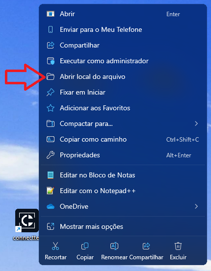
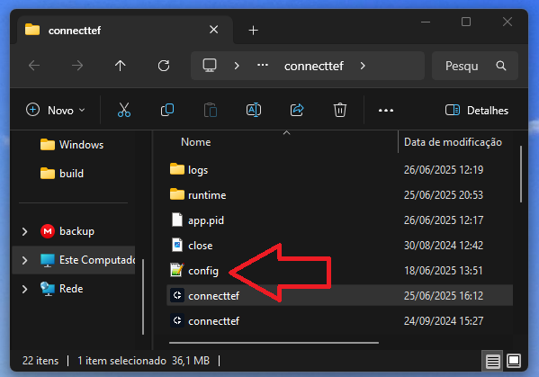
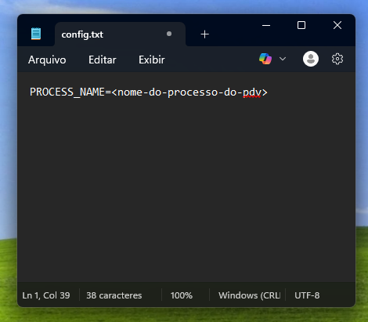

# SITEF

Siga os passos abaixo para integrar o Connect TEF ao seu PDV que já utiliza o SiTef via DLL.

> ⚠️ *Se o gerenciador ainda não estiver instalado e configurado, a configuração a seguir não será possível.*
> 👉 Consulte a [**documentação de instalação e configuração do gerenciador padrão**](./windows.md) para realizar esse processo antes de continuar.

---

### Passo 1: Baixar as Interfaces Necessárias

Baixe os dois arquivos abaixo:

| Sistema Operacional         | Download |
|-----------------------------|----------|
| CliSiTef32I.dll             | [Download](https://arquivos.pdvpos.com.br/connecttef/CliSiTef32I.dll)         |
| InterfaceConnectTEF.dll     | [Download](https://arquivos.pdvpos.com.br/connecttef/InterfaceConnectTEF.dll) |

---

### Passo 2: Remover DLLs Antigas

Remova o arquivo **CliSiTef32I.dll** original dos seguintes diretórios (se existirem):

- `C:\Windows`
- `C:\Windows\System32`
- `C:\Windows\SysWOW64`

> ⚠️ Isso é importante para evitar conflitos com versões antigas da DLL.

---

### Passo 3: Copiar as Novas DLLs

Copie os arquivos **baixados no passo 1** para o diretório:

- `C:\Windows`

---

### Passo 4: Acessar o Diretório do Connect TEF

1. Vá até a **área de trabalho**.
2. Clique com o **botão direito** no atalho **Connect TEF**.
3. Selecione **“Abrir local do arquivo”**.


---

### Passo 5: Criar o Arquivo `config.txt`

Dentro do diretório que foi aberto:

1. Crie um novo arquivo chamado:  
   `config.txt`



2. Edite o arquivo e adicione a seguinte linha:

```

PROCESS_NAME=<nome-do-processo-do-pdv>

```

> Substitua `<nome-do-processo-do-pdv>` pelo **nome real do executável do seu PDV** que já usa o SiTef.



---

### Pronto!

A partir deste momento, o PDV já está **compatível com o Connect TEF** utilizando a integração via SiTef.