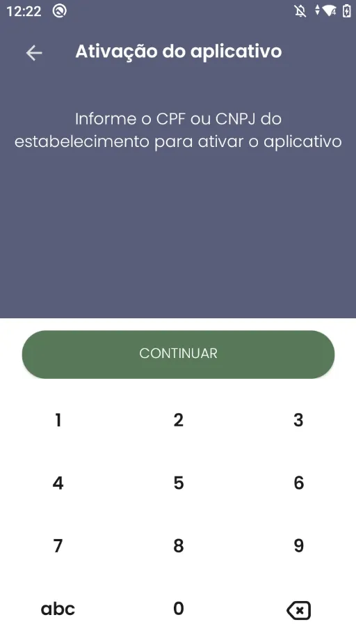
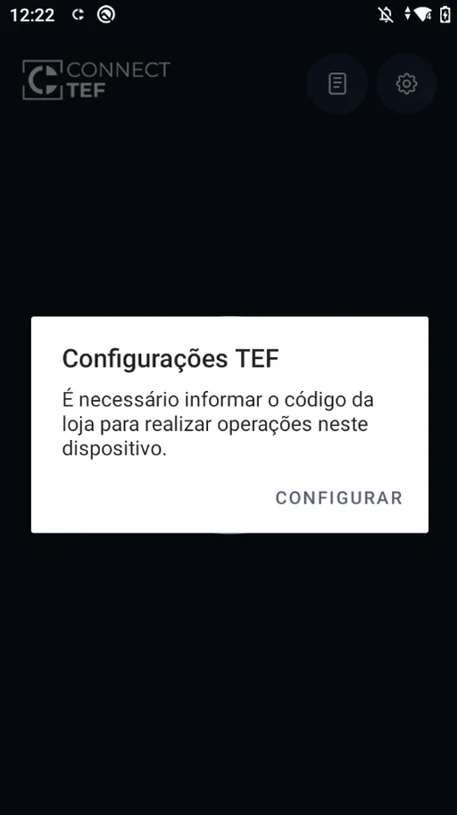
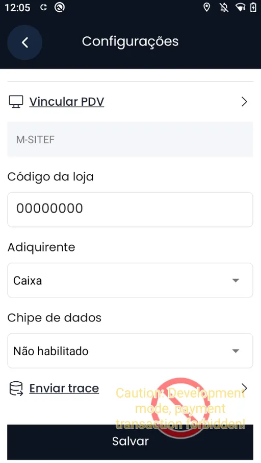
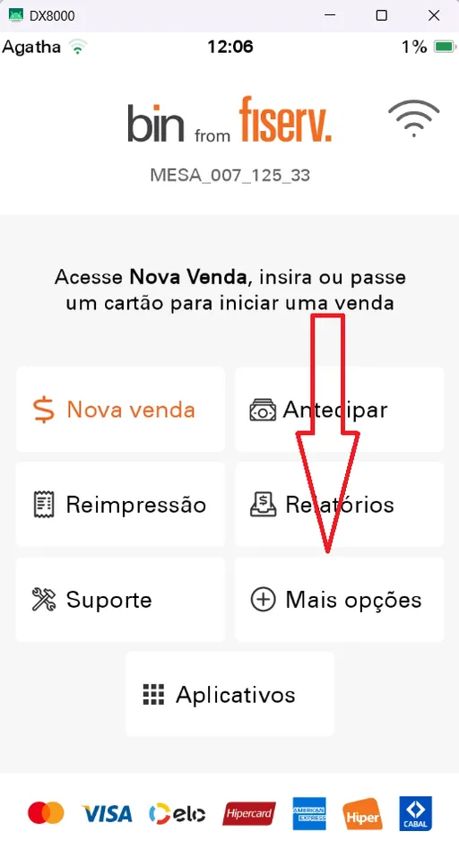
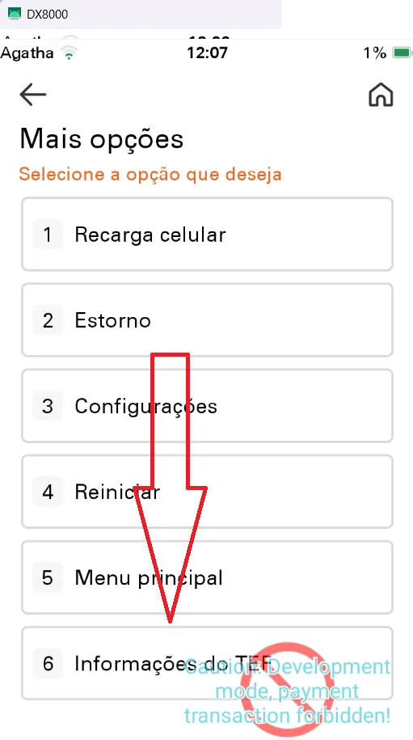
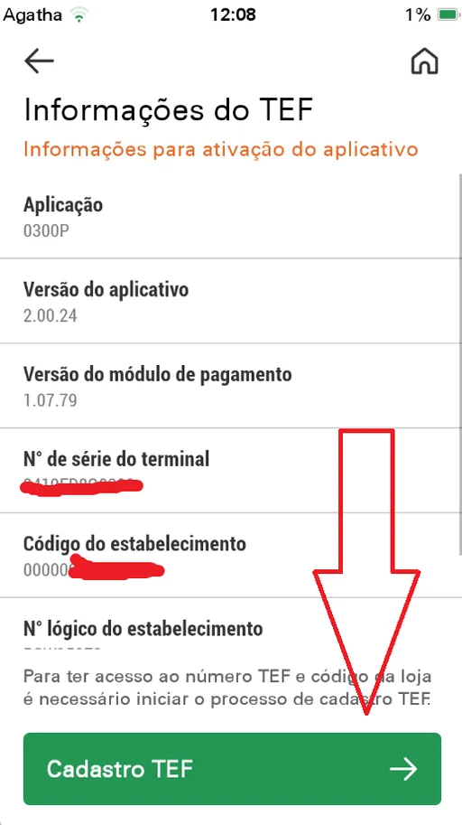
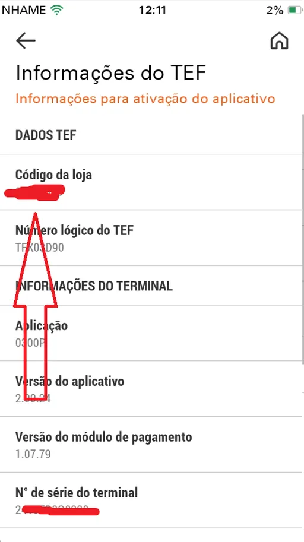
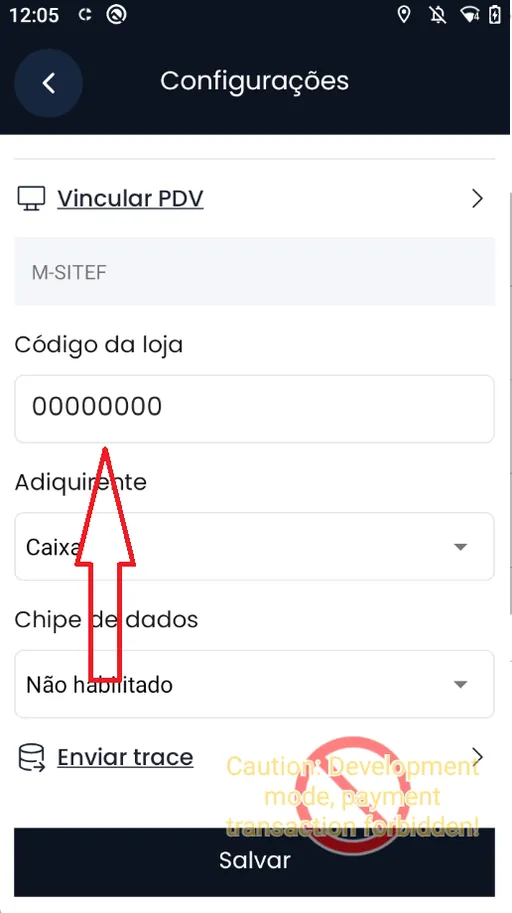

# Fiserv

Este guia apresenta o passo a passo para ativar e configurar o aplicativo **Connect TEF** no Smart POS.

---

### Passo 1: Ativação do Aplicativo

- Ao abrir o aplicativo **ConnectTEF** pela primeira vez, será solicitado o **CNPJ da empresa**.
- Digite corretamente o CNPJ e toque em **"Continuar"**.

---

### Passo 2: Solicitação de Configuração TEF

- Após informar o CNPJ, uma janela será exibida solicitando a **configuração do TEF**.
- Toque em **"Configurar"** para iniciar.

---

### Passo 3: Preenchimento da Configuração

Na tela de configuração, informe os seguintes dados:

- **Código da Loja**
- **Adquirente** (Ex: Sicred)
- **Chip de dados** (caso o dispositivo utilize um chip fornecido pela adquirente)

---

### Passo 4: Acessar o Menu Principal

- Vá até a **tela inicial** do Smart POS.
- Toque em **"Mais Opções"**.

---

### Passo 5: Informações do TEF

- Em seguida, selecione a opção **"Informações TEF"**.

---

### Passo 6: Configurar TEF (se necessário)

- Se houver um **botão verde** no fim da tela com a opção de configurar o CNPJ, toque nele e siga as instruções.
- Caso contrário, siga para o próximo passo.

---

### Passo 7: Obter o Código da Loja

- O **Código da Loja** será exibido na tela.
- Anote este código — ele será necessário para finalizar a configuração.

---

### Passo 8: Finalizar no ConnectTEF

- Volte ao app **ConnectTEF**
- Preencha o **Código da Loja**
- Complete os campos obrigatórios e toque em **Salvar**

---

Pronto! O ConnectTEF está configurado corretamente e pronto para ser utilizado com a captura **Fiserv** no seu Smart POS.