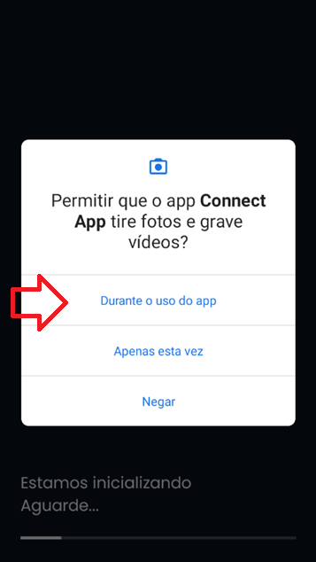
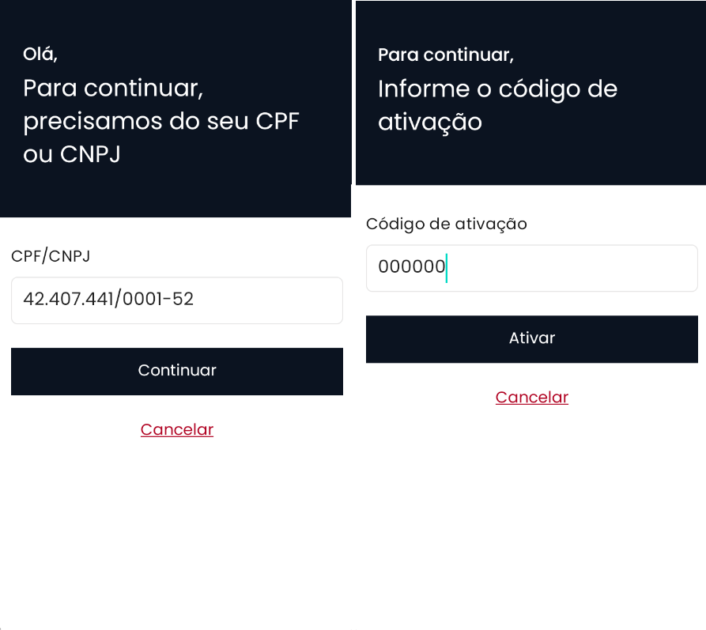
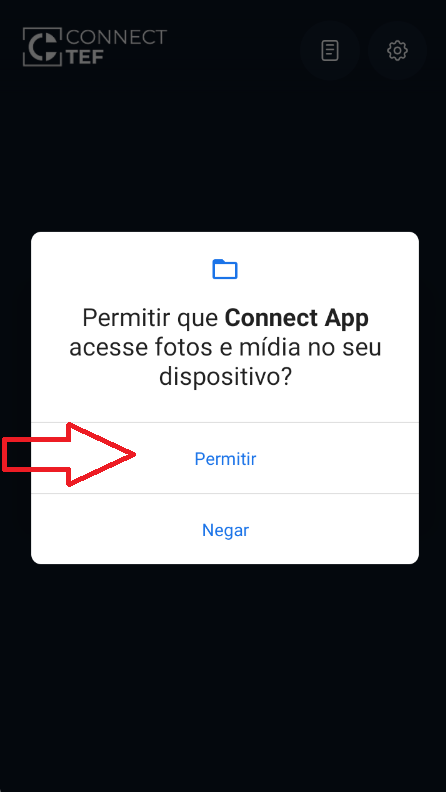

# Smart POS

Siga os passos abaixo para ativar o aplicativo Connect TEF na sua maquininha de cartão Smart POS. Esse processo é rápido e feito uma única vez.

---

### Passo 1: Abrir o Aplicativo

1. Ligue a maquininha.
2. Toque no ícone **Connect TEF** para abrir o app.

---

### Passo 2: Permitir Acessos

- Ao abrir o app pela primeira vez, ele vai pedir algumas permissões.
- **Toque em "Permitir"** sempre que aparecer.

> ⚠️ Essas permissões são necessárias para o funcionamento correto do aplicativo.

---

### Passo 3: Informar os Dados

- Na tela de ativação, informe:
    - **Seu CNPJ**
    - **O código de ativação** (fornecido pelo seu representante comercial)

---

### Passo 4: Aguarde a Ativação

- Depois de preencher os dados, o aplicativo vai fazer a ativação automática.
- Isso pode levar alguns segundos.
- Mantenha a maquininha conectada à internet.

---

### Passo 5: Permissões Finais (se aparecer)

- Pode ser que o app peça mais permissões após a ativação.
- **Novamente, toque em "Permitir"** sempre que solicitado.

---

### Pronto!

- O aplicativo está **ativado** e **pronto para uso**.

