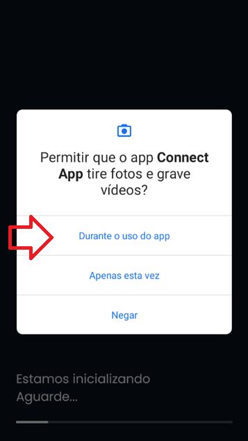
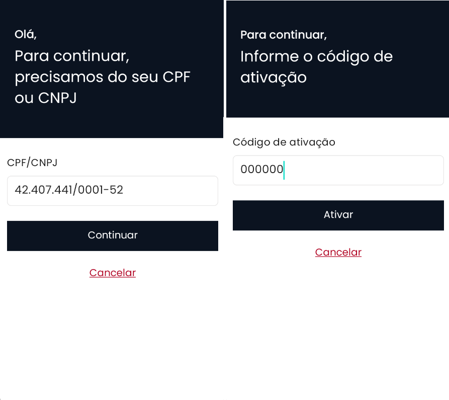
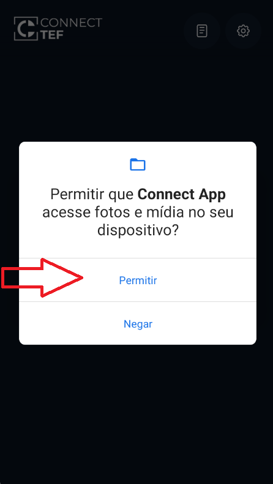

# Ativar o app no SmartPOS

Siga os passos abaixo para ativar o aplicativo ConnectTEF na sua maquininha de cartão SmartPOS. Esse processo é rápido e feito uma única vez.

---

### Passo 1: Abrir o Aplicativo

1. Ligue a maquininha.
2. Toque no ícone **Connect TEF** para abrir o app.

---

### Passo 2: Permitir Acessos

- Ao abrir o app pela primeira vez, ele vai pedir algumas permissões.
- **Toque em "Permitir"** sempre que aparecer.

> ⚠️ Essas permissões são necessárias para o funcionamento correto do aplicativo.

---

### Passo 3: Informar os Dados

Na tela de ativação, informe:

- **CNPJ do estabelecimento proprietário do SmartPOS**
  > ⚠️ Não utilize o CNPJ da revenda ou da empresa integradora. Informe o CNPJ do cliente onde o equipamento será utilizado.

- **Código de ativação**
  > Informe os **6 primeiros dígitos do CNPJ informado acima**.

---

### Passo 4: Aguarde a Ativação

- Depois de preencher os dados, o aplicativo vai fazer a ativação automática.
- Isso pode levar alguns segundos.
- Mantenha a maquininha conectada à internet.

---

### Passo 5: Permissões Finais (se aparecer)

- Pode ser que o app peça mais permissões após a ativação.
- **Novamente, toque em "Permitir"** sempre que solicitado.

---

### Pronto!

- O aplicativo está **ativado** e **pronto para uso**.

