# Windows

O **Connect TEF** é uma ponte entre seu sistema de vendas (PDV) e a maquininha de cartão Smart POS. Este guia mostra como instalar e configurar o Connect TEF no Windows para começar a realizar transações com segurança e agilidade.

---

### Passo 1: Baixar o Instalador

Escolha a versão compatível com o sistema operacional do seu computador:

| Sistema Operacional | Download |
|---------------------|----------|
| Windows 32 bits     | [Download](https://arquivos.pdvpos.com.br/connecttef/gerenciador-padrao/instaladores/setup-32.exe) |
| Windows 64 bits     | [Download](https://arquivos.pdvpos.com.br/connecttef/gerenciador-padrao/instaladores/setup-64.exe) |

---

### Passo 2: Instalar o Gerenciador Padrão

1. Execute o arquivo `setup.exe` baixado.
2. Caso apareça um aviso de segurança do Windows:
   - Clique em **Mais informações**
   
   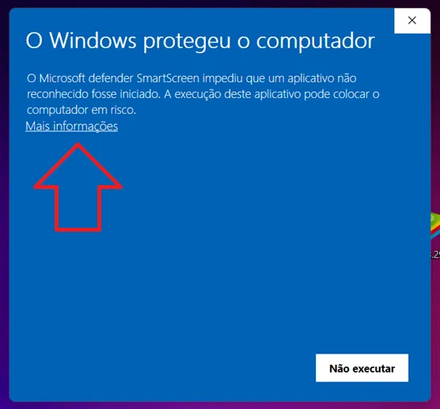

   - Clique em **Executar mesmo assim**
   
   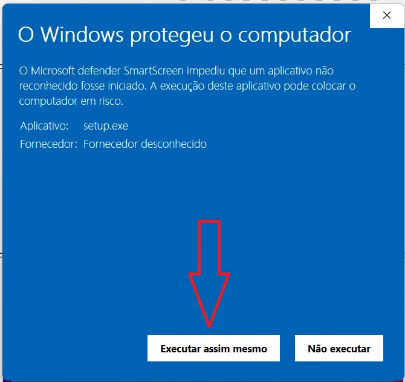

3. Siga as etapas do instalador:

   - Clique em **Instalar**

   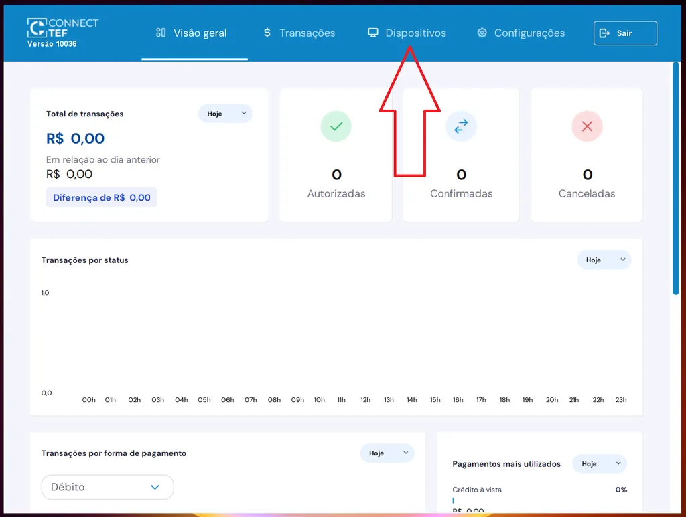

   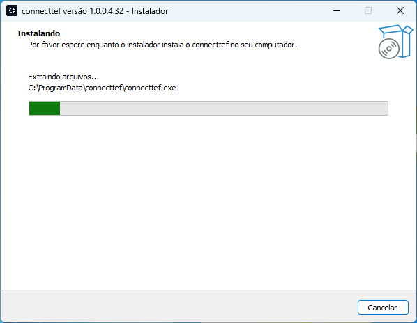

   - Clique em **Concluir**

   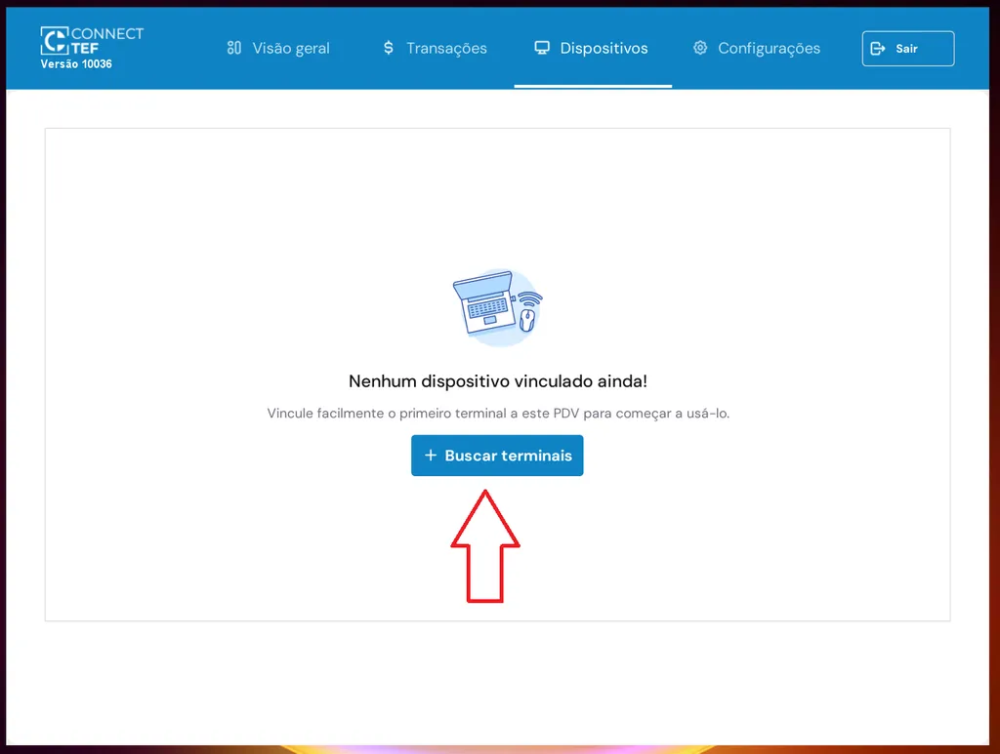

---

> ⚠️ **Atenção,** siga os passos abaixo **antes de prosseguir com a ativação**:

1. Vá até o local onde o programa **ConnectTEF** está instalado.

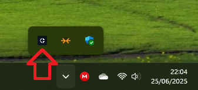

2. Clique com o **botão direito do mouse** sobre o executável do **ConnectTEF** e selecione a opção **"Propriedades"**.

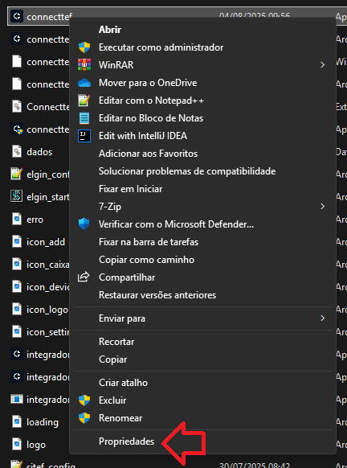

3. Vá até a aba **"Compatibilidade"** e marque a opção:
   - ✅ **"Executar este programa em modo de compatibilidade"**
   - No menu suspenso, selecione **Windows 8**, se não houver, **Windows 7**.
6. Clique em **"OK"** para salvar as alterações.

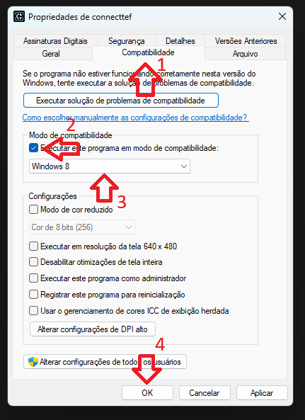

### Passo 3: Ativação do gerenciador padrão

1. **Abra o Connect TEF localizado na área de trabalho**

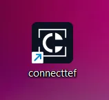

2. **Na tela de ativação, informe seu CNPJ e o código de ativação fornecido pelo seu representante comercial.**

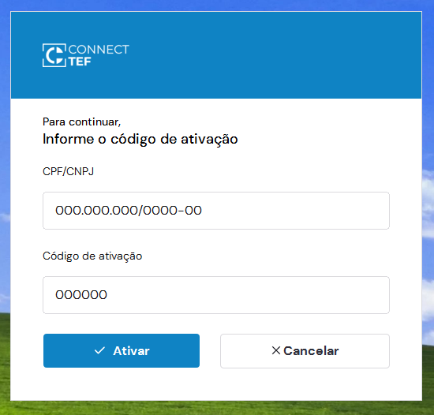 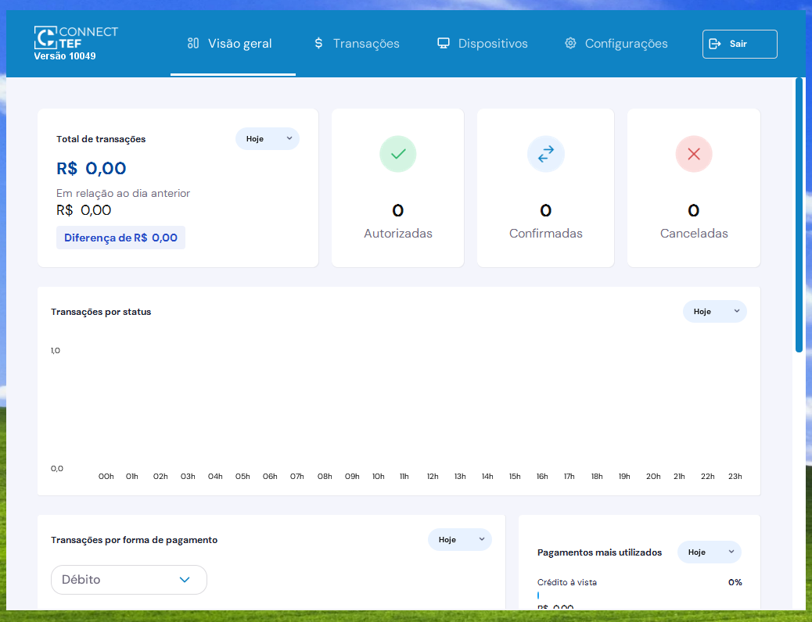

### Pronto! O Connect TEF está instalado e ativado

> 👉 Para vincular sua maquininha Smart POS ao Gerenciador Padrão, consulte a [**documentação de vinculação do dispositivo**](../duvidas/como-vincular-smartpos.md).