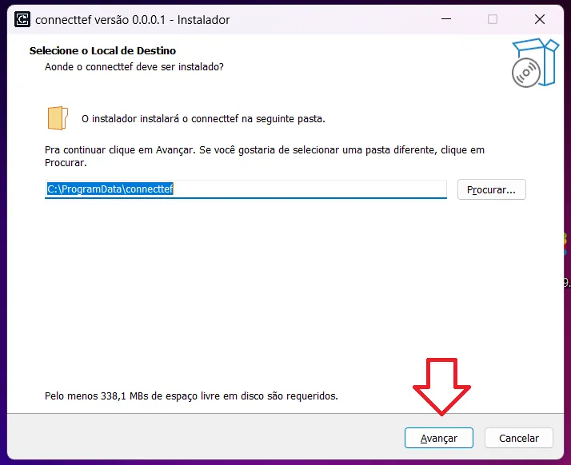
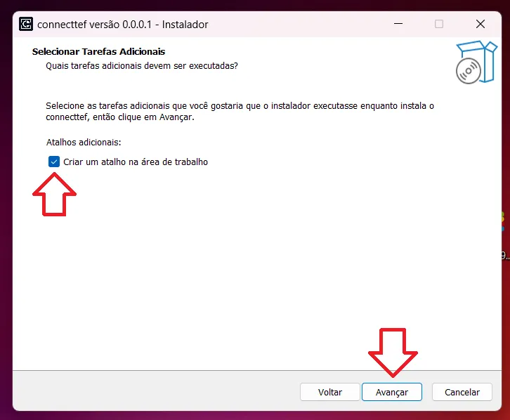
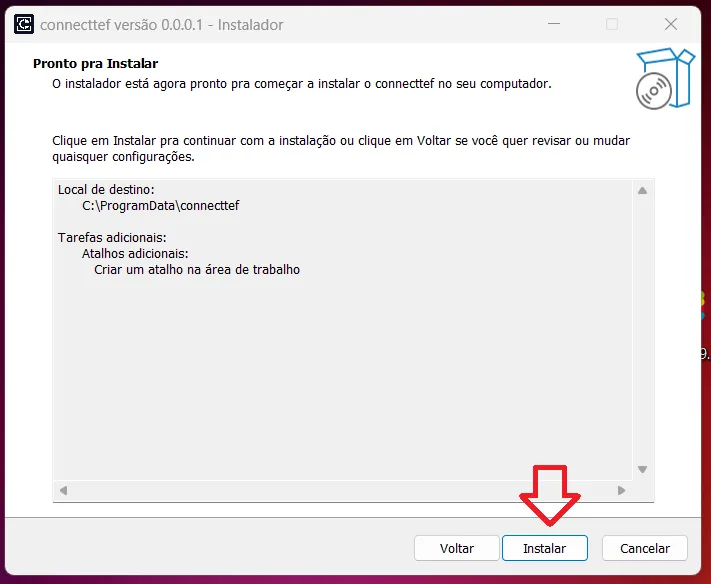
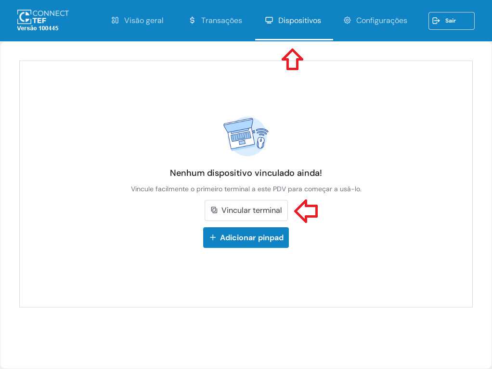
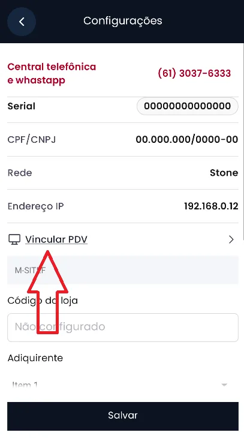
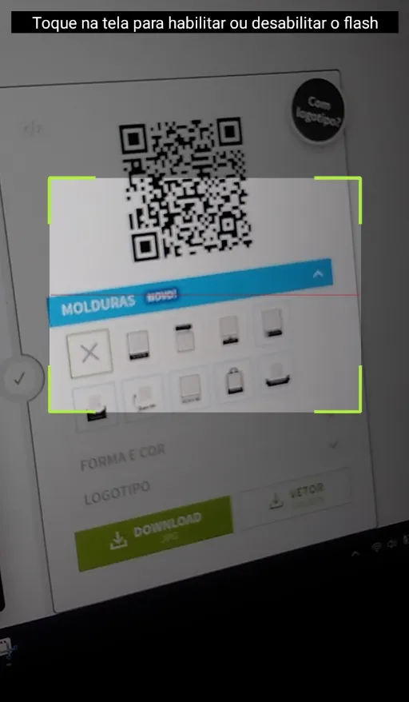
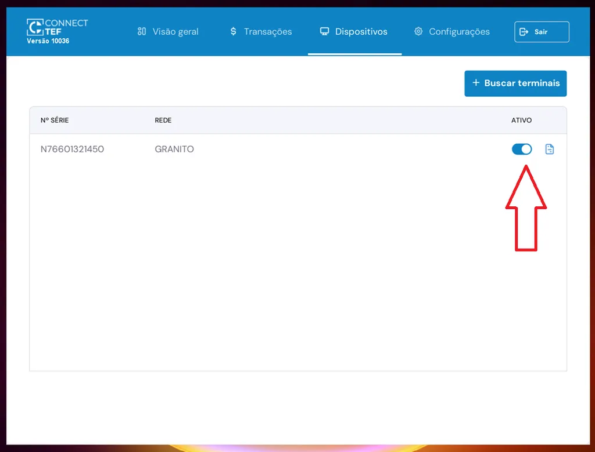

# Windows

O **Connect TEF** é uma ponte entre seu sistema de vendas (PDV) e a maquininha de cartão Smart POS. Este guia mostra como instalar e configurar o Connect TEF no Windows para começar a realizar transações com segurança e agilidade.

---

### Passo 1: Baixar o Instalador

Escolha a versão compatível com o sistema operacional do seu computador:

| Sistema Operacional | Download |
|---------------------|----------|
| Windows 32 bits     | [Download](https://arquivos.pdvpos.com.br/connecttef/setup-32.exe) |
| Windows 64 bits     | [Download](https://arquivos.pdvpos.com.br/connecttef/setup-64.exe) |

---

### Passo 2: Instalar o Gerenciador Padrão

1. Execute o arquivo `setup.exe` baixado.
2. Caso apareça um aviso de segurança do Windows:
   - Clique em **Mais informações**
   
   

   - Clique em **Executar mesmo assim**
   
   

3. Siga as etapas do instalador:

   - Clique em **Avançar**

   

   - Marque a opção **Criar um atalho na área de trabalho**

   

   - Clique em **Instalar**

   

4. Aguarde o término da instalação. Você pode escolher **não reiniciar o computador imediatamente**, mas recomendamos reiniciar **após finalizar toda a configuração**.

---

### Passo 3: Gerar QR Code

Após a instalação, um atalho chamado **Connect TEF** será criado na área de trabalho. Siga os passos:

1. **Abra o Connect TEF**

2. Clique na aba **Dispositivos**

3. Clique em **Buscar terminais**

Um **QR Code** será exibido na tela:

---

### Passo 4: Vincular SmartPOS

No Smart POS:

1. Abra o app `connecttef`
2. Toque no ícone de **Configurações** (⚙️)

3. Toque em **Vincular PDV**

4. Aponte a câmera para o QR Code exibido no computador

Após leitura bem-sucedida:

- O terminal aparecerá na lista do Connect TEF
- Ative o **switch** para concluir a vinculação

---

Pronto! O Connect TEF está instalado, configurado e vinculado ao seu terminal Smart POS. Agora você pode iniciar transações diretamente do seu PDV com segurança e eficiência.