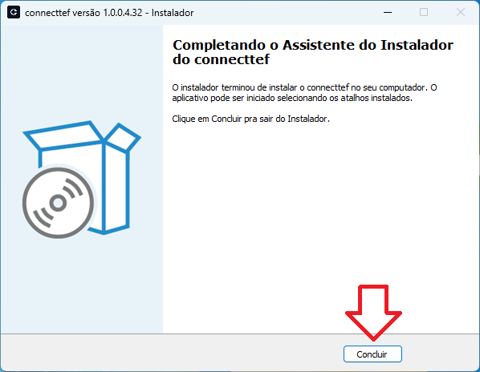
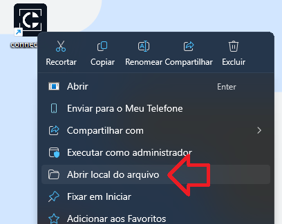
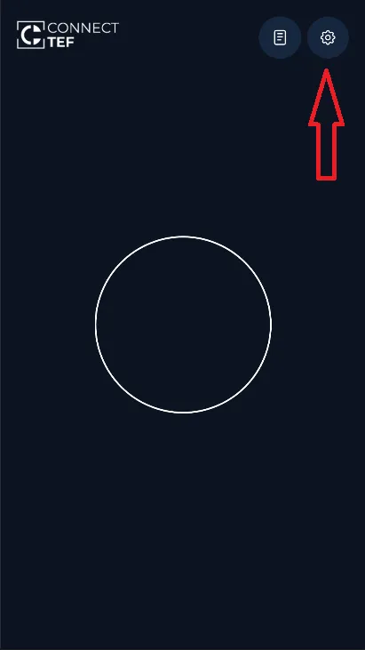
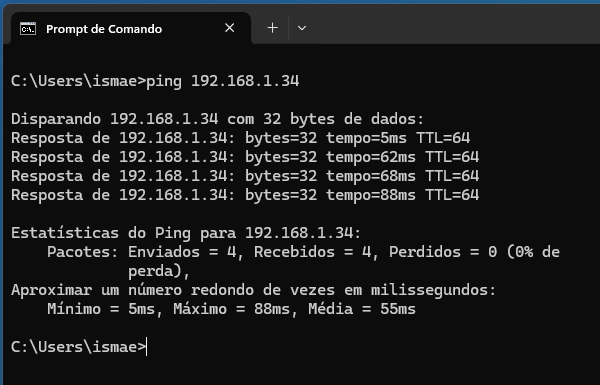

# Windows

O **Connect TEF** é uma ponte entre seu sistema de vendas (PDV) e a maquininha de cartão Smart POS. Este guia mostra como instalar e configurar o Connect TEF no Windows para começar a realizar transações com segurança e agilidade.

---

### Passo 1: Baixar o Instalador

Escolha a versão compatível com o sistema operacional do seu computador:

| Sistema Operacional | Download |
|---------------------|----------|
| Windows 32 bits     | [Download](https://arquivos.pdvpos.com.br/connecttef/gerenciador-padrao/instaladores/setup-32.exe) |
| Windows 64 bits     | [Download](https://arquivos.pdvpos.com.br/connecttef/gerenciador-padrao/instaladores/setup-64.exe) |

---

### Passo 2: Instalar o Gerenciador Padrão

1. Execute o arquivo `setup.exe` baixado.
2. Caso apareça um aviso de segurança do Windows:
   - Clique em **Mais informações**
   
   

   - Clique em **Executar mesmo assim**
   
   

3. Siga as etapas do instalador:

   - Clique em **Instalar**

   

   

   - Clique em **Concluir**

   

---

> ⚠️ **Atenção,** siga os passos abaixo **antes de prosseguir com a ativação**:

1. Vá até o local onde o programa **ConnectTEF** está instalado.

2. Clique com o **botão direito do mouse** sobre o executável do **ConnectTEF** e selecione a opção **"Propriedades"**.

3. Vá até a aba **"Compatibilidade"** e marque a opção:
   - ✅ **"Executar este programa em modo de compatibilidade"**
   - No menu suspenso, selecione **Windows 8**, se não houver, **Windows 7**.
6. Clique em **"OK"** para salvar as alterações.

### Passo 3: Ativação do gerenciador padrão

1. **Abra o Connect TEF localizado na área de trabalho**

2. **Na tela de ativação, informe seu CNPJ e o código de ativação fornecido pelo seu representante comercial.**

### Passo 4: Vincular terminal

- Clique na aba **Dispositivos**
- Clique em **Buscar terminais**

- Um QR Code será exibido na tela:

No Smart POS:

- Abra o app `connecttef`
- Toque no ícone de **Configurações** (⚙️)

- Toque em **Vincular PDV**

- Aponte a câmera para o QR Code exibido no computador

Após leitura bem-sucedida:

- O terminal aparecerá na lista do Connect TEF
- Ative o **switch**

### Passo 5: Configurar conexão local

1. Abra o CMD

2. Realize um ping para o ip do terminal

3. Liste os dispositivos usando o comando **arp -a** e copie o endereço mac correspondente ao ip

4. Clique sobre o dispositivo vinculado e informe o endereço mac copiado e na sequencia o ip

4. Clique em sair para aplicar as configurações

---

Pronto! O terminal Smart POS foi vinculado ao seu gerenciador padrão e está pronto para o uso via rede WIFI.