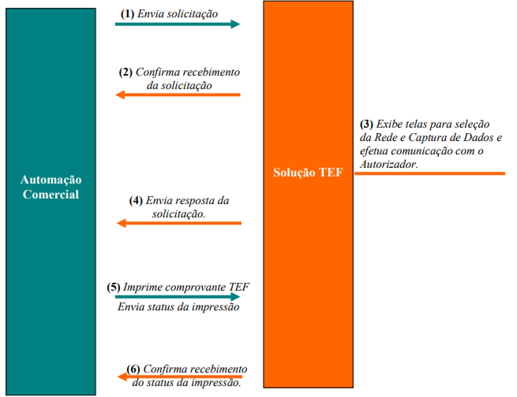

# Introdução

Este manual descreve como integrar um software de automação comercial com a solução Connectt TEF através da **troca de arquivos**. As operações suportadas incluem:

- Pagamento
- Estorno
- Reimpressão

---

### Comunicação entre Sistemas

Os arquivos trocados ficam em diretórios específicos:

- **Envio de dados**: `C:\TEF_DIAL\REQ`
- **Recebimento de dados**: `C:\TEF_DIAL\RESP`

---

### Como Funciona a Integração

O Aplicativo de Automação Comercial (AAC) é responsável por:

- Realizar vendas
- Cumprir leis ECF/SAT/NFC-e
- Imprimir cupons e comprovantes TEF

### Etapas da Integração

1. A Automação Comercial gera o arquivo `IntPos.001` no diretório `REQ`.
2. O Gerenciador cria o arquivo `IntPos.Sts` em `RESP` indicando que está ativo.
>- ⚠️ Se **não houver resposta em até 7 segundos**, o Gerenciador pode não estar em execução.
3. O Gerenciador exibe a tela para seleção da **bandeira/rede** desejada.
4. O Gerenciador processa a transação e envia resposta para `RESP\IntPos.001`.
5. Se houver comprovante, ele é impresso, e o status é retornado para `REQ\IntPos.001`.
6. O Gerenciador confirma o status gerando o arquivo `RESP\IntPos.Sts`.

>**⚠️ Observações Importantes**
>- **Transações sem comprovante** finalizam na etapa 4.  
>- **Transações com comprovante** seguem até a etapa 6.  
>- A transação especial "ATV" termina na etapa 2.
>- Em caso de **queda de energia** após o envio do `IntPos.001` (etapa 1), a Automação deve enviar automaticamente uma transação com o código `NCN`.
>- A **mensagem do campo `030-000`** deve ser exibida pela Automação Comercial quando **não estiver vazia**:
>  - Se houver linhas para impressão:
>    - Exibir a mensagem simultaneamente à impressão.
>    - A mensagem deve permanecer por pelo menos **5 segundos** ou durante toda a impressão.
>    - Não esperar confirmação do usuário.
>  - Se não houver linhas para impressão:
>    - Aguardar confirmação do usuário (OK) para seguir.

---

### Fluxograma da Operação

Este fluxograma mostra as etapas da operação TEF do ponto de vista da Automação Comercial.

---

### Estrutura dos Arquivos

Cada operação requer um arquivo de solicitação com uma estrutura específica e um arquivo de resposta com os dados do processamento. Abaixo está a estrutura genérica dos arquivos

| Código    | Nome                                | Descrição                                                                 | Formato                      | Valores Possíveis / Observações                                                                  |
|-----------|-------------------------------------|---------------------------------------------------------------------------|------------------------------|--------------------------------------------------------------------------------------------------|
| 000-000   | HEADER                              | Início do arquivo e tipo de operação                                 | Alfanumérico (3 bytes)       | CRT, CNC, CNF,  NCN, ADM, ATV,  CDP, SRV                                                           |
| 001-000   | IDENTIFICAÇÃO                       | Número único da transação, repetido em todas as etapas                    | Numérico (até 10 bytes)      | -                                                                                                |
| 003-000   | VALOR TOTAL                         | Valor da operação em centavos (Ex: R$10,00 = 1000)                        | Numérico (até 10 bytes)      | -                                                                                                |
| 006-000   | TIPO DE PESSOA                      | Tipo de pessoa envolvida                                                  | Alfanumérico (1 byte)        | F – Pessoa Física (CPF),  J – Pessoa Jurídica (CNPJ)                                              |
| 007-000   | DOCUMENTO DA PESSOA                 | CNPJ ou CPF da pessoa                                                     | Numérico (16 bytes)          | -                                                                                                |
| 009-000   | STATUS DA TRANSAÇÃO                 | Indica se foi aprovada                                                    | Alfanumérico (até 3 bytes)   | 0 = Aprovada,  ≠ 0 = Erro                                                                         |
| 010-000   | NOME DA REDE                        | Nome da rede processadora                                                 | Alfanumérico (até 12 bytes)  | PAGSEGURO, STONE                                                                                 |
| 011-000   | TIPO DA TRANSAÇÃO                   | Tipo da transação                                                         | Numérico (até 2 bytes)       | 10 - Cartão de Crédito à Vista 11 - Crédito Parcelado pela Loja 12 - Crédito Parcelado pele cliente 20 - Cartão de Débito à Vista 30 - PIX/Carteira digital 60 - Voucher / PAT 70 - Consulta Cheque 99 - Outras  EM OPERAÇÕES CDP: 0 - Solicitar CPF/CNPJ 1 - Solicitar Telefone 2 - Solicitar E-Mail 3 - Solicitar Avaliação 4 - Solicitação avulsa  EM OPERAÇÕES SRV: 0 - Coletor de dados 1 - Ler código de barras 2 - Imprimir imagem base64 3 - Imprimir texto 6 - Reimpressão estabelecimento 7 - Reimpressão cliente
| 012-000   | NÚMERO DA TRANSAÇÃO                 | NSU gerado no Host                                                        | Numérico (até 14 bytes)      | -                                                                                                |
| 013-000   | CÓDIGO DE AUTORIZAÇÃO               | Código de autorização da transação                                        | Numérico (até 6 bytes)       | -                                                                                                |
| 015-000   | TIMESTAMP HOST                      | Data/hora da transação no Host                                            | Numérico (DDMMHHMMSS)        | -                                                                                                |
| 016-000   | TIMESTAMP LOCAL                     | Data/hora da transação no PDV                                             | Numérico (DDMMHHMMSS)        | -                                                                                                |
| 017-000   | TIPO DE PARCELAMENTO                | Tipo de parcelamento                                                      | Numérico (até 2 bytes)       | 0 = Loja, 1 = Cliente                                                                            |
| 018-000   | QUANTIDADE DE PARCELAS              | Número de parcelas                                                        | Numérico (1 byte)            | -                                                                                                |
| 022-000   | DATA DA TRANSAÇÃO COMPROVANTE       | Data da transação                                                         | Numérico (DDMMAAAA)          | -                                                                                                |
| 023-000   | HORA DA TRANSAÇÃO COMPROVANTE       | Hora da transação                                                         | Numérico (HHMMSS)            | -                                                                                                |
| 025-000   | NSU DA TRANSAÇÃO CANCELADA          | NSU da transação que será cancelada                                       | Numérico (até 14 bytes)      | -                                                                                                |
| 026-000   | TIMESTAMP CANCELAMENTO - HOST       | Data/hora da transação cancelada no Host                                  | Numérico (DDMMHHMMSS)        | -                                                                                                |
| 027-000   | FINALIZAÇÃO                         | Dados agrupados da operação                                               | Alfanumérico (até 30 bytes)  | -                                                                                                |
| 028-000   | QUANTIDADE DE LINHAS DO COMPROVANTE | Número de linhas do comprovante                                           | Alfanumérico (até 40 bytes)  | 0 = Sem comprovante                                                                              |
| 029-YYY   | IMAGEM DE LINHA DO COMPROVANTE      | Cada linha do comprovante (YYY = número da linha: 001, 002, ...)          | Alfanumérico (até 40 bytes)  | Baseado no campo 028                                                                             |
| 030-000   | TEXTO ESPECIAL OPERADOR             | Texto exibido ao operador                                                 | Alfanumérico (até 40 bytes)  | Mostrar se não estiver vazio                                                                     |
| 031-000   | TEXTO ESPECIAL CLIENTE              | Texto exibido ao cliente                                                  | Alfanumérico (até 40 bytes)  | Mostrar se não estiver vazio                                                                     |
| 400-001   | CPF/CNPJ DO BENEFICIÁRIO            | Documento de quem recebe                                                  | Numérico (16 bytes)          | -                                                                                                |
| 400-002   | BANDEIRA DO CARTÃO                  | Bandeira do cartão                                                        | Alfanumérico (até 12 bytes)  | VISA, MASTERCARD, etc.                                                                           |
| 400-003   | NÚMERO DE SÉRIE DO DISPOSITIVO      | Serial impresso no POS                                                    | Base64 String                | -                                                                                                |
| 400-004   | IMAGEM EM BASE64                    | Imagem em base64 para impressão                                           | Base64 String                | -                                                                                                |
| 400-005   | TEXTO PARA IMPRESSÃO                | Texto a ser impresso                                                      | String                       | -                                                                                                |
| 999-999   | REGISTRO FINAL                      | Marca o fim do arquivo                                                    | Numérico (1 byte)            | Valor fixo: 0                                                                                    |
