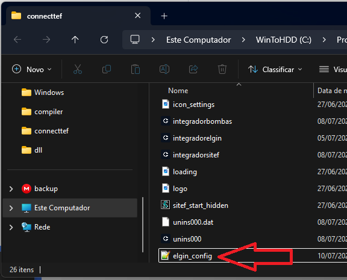
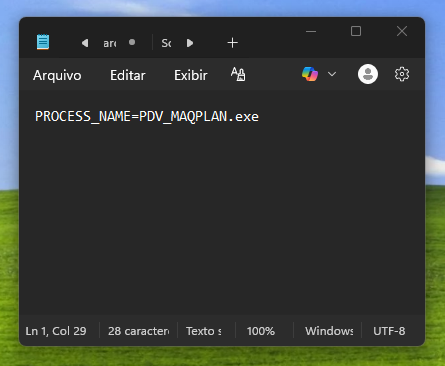

# TEF Ativo (DLL)

Siga os passos abaixo para integrar o Connect TEF ao seu PDV que já utiliza o Elgin via DLL.

> ⚠️ *Se o gerenciador ainda não estiver instalado e configurado, a configuração a seguir não será possível.*
> 👉 Consulte a [**documentação de instalação e configuração do gerenciador padrão**](../../guia-ativacao/windows.md) para realizar esse processo antes de continuar.

---

### Passo 1: Baixar a interface de integração

| Sistema Operacional                 | Download |
|-------------------------------------|----------|
| InterfaceConnectTEF.dll (X64)       | [Download](https://arquivos.pdvpos.com.br/connecttef/gerenciador-padrao/dll/InterfaceConnectTEF-X64.dll)   |
| InterfaceConnectTEF.dll (X86)       | [Download](https://arquivos.pdvpos.com.br/connecttef/gerenciador-padrao/dll/InterfaceConnectTEF-X86.dll)   |
| InterfaceConnectTEF.dll (Win32)     | [Download](https://arquivos.pdvpos.com.br/connecttef/gerenciador-padrao/dll/InterfaceConnectTEF-Win32.dll) |


### Passo 2: Copiar a dll

Copie a dll **baixada no passo 1** para o diretório:

- `C:\Windows`

---

### Passo 4: Acessar o Diretório do Connect TEF

1. Vá até a **área de trabalho**.
2. Clique com o **botão direito** no atalho **Connect TEF**.
3. Selecione **“Abrir local do arquivo”**.


---

### Passo 5: Criar o Arquivo `elgin_config.txt`

Dentro do diretório que foi aberto:

1. Crie um novo arquivo chamado:  
   `elgin_config.txt`

> Imagem ilustrativa o nome do arquivo deve ser **elgin_config.txt**


2. Edite o arquivo e adicione a seguinte linha:

```

PROCESS_NAME=<nome-do-processo-do-pdv>

```

> Substitua `<nome-do-processo-do-pdv>` pelo **nome real do executável do seu PDV** que já usa o Elgin.



---

### Pronto!

A partir deste momento, o PDV já está **compatível com o Connect TEF** utilizando a integração via Elgin.