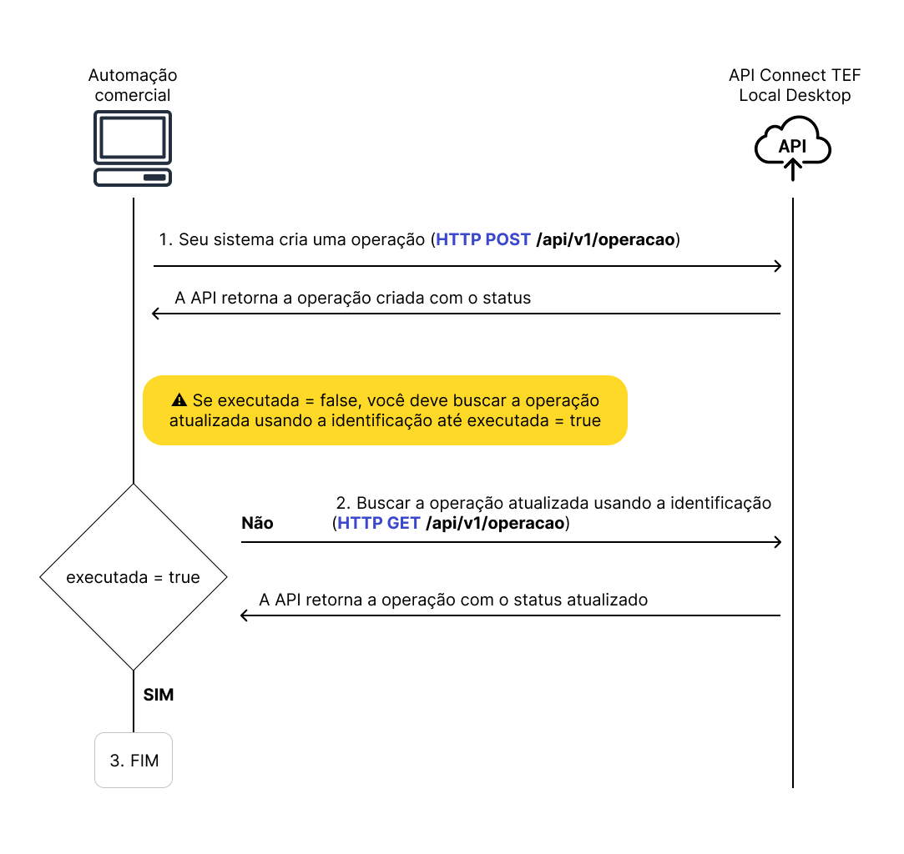

# Introdução

A **API ConnectTEF Local Desktop** permite que automações comerciais integrem-se ao ConnectTEF de forma local, mantendo controle sobre o fluxo das operações TEF por meio de chamadas HTTP ao ambiente da estação Windows.

Esta documentação apresenta o funcionamento da API, fluxo de chamadas, e requisitos para integração adequada.

---

## Fluxo de execução

As operações TEF seguem o fluxo ilustrado abaixo:

1. Seu sistema cria uma operação (**HTTP POST** `/api/v1/operacao`).
2. A API retorna a operação criada com o status
3. Se `executada` = **false**, você deve realizar uma busca periódica (`polling`) com **HTTP GET** `/api/v1/operacao` até que `executada` = **true**.
4. Quando a operação estiver concluída, você receberá os dados finais com status atualizado.

---

> ⚠️ **Importante**: o campo `executada` indica se a operação foi finalizada. Somente após ele ser `true` os dados da operação estarão completos.
