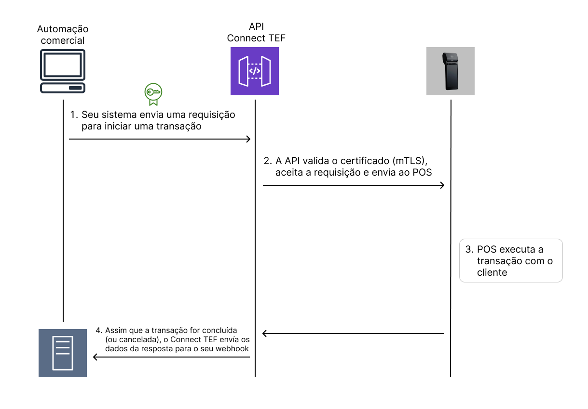

# Introdução

A **API ConnectTEF** permite a integração com terminais SmartPOS. Esta documentação descreve o funcionamento da API e como integrá-la corretamente.

---

## 🔐 Autenticação mTLS

Todas as requisições à API ConnectTEF utilizam **mutual TLS (mTLS)** como forma de autenticação e segurança. Isso significa que:

- O cliente deve apresentar um certificado válido (cliente X.509) durante o handshake TLS.
- O servidor validará o certificado do cliente antes de aceitar qualquer requisição.
- A porta e o domínio de acesso serão fornecidos após o credenciamento.

> ❗ Certificados inválidos, expirados ou não autorizados resultarão em erro 403 (Forbidden).

---

## 🔁 Comunicação assíncrona via Webhook

A API ConnectTEF opera de forma **assíncrona**. Após o envio de uma requisição (como iniciar uma transação), a resposta final **não é retornada diretamente no corpo da requisição**.

Em vez disso:

- O integrador deve informar um **endpoint Webhook** no corpo da requisição inicial.
- O ConnectTEF enviará a resposta completa para esse endpoint, incluindo o status final da operação, dados da transação, e erros (se houver).

---

## Token de autenticação (opcional)

Para reforçar a segurança na comunicação com o webhook, é possível (e recomendado) informar um **token de autenticação** junto à requisição inicial.

Esse token será enviado no header `token` da chamada ao seu webhook, no seguinte formato:

```http
token: seu_token_aqui
````

> Isso garante que apenas chamadas originadas do ConnectTEF sejam aceitas pelo seu endpoint.

---

## Exemplo do fluxo de integração

1. Seu sistema envia uma requisição `POST` para iniciar uma transação no SmartPOS.
2. A API valida o certificado (mTLS) e aceita a requisição.
3. O SmartPOS executa a transação com o cliente.
4. Assim que a transação for concluída (ou cancelada), o ConnectTEF envia os dados da resposta para o seu Webhook.


---

## 🚨 Requisitos mínimos

* Certificado digital de cliente válido para mTLS
* Endpoint de Webhook público
* Capacidade de lidar com chamadas assíncronas
* Manuseio do token de autenticação (opcional, mas recomendado)

---

## ▶️ Próximos passos

Agora que você já entendeu o funcionamento geral da API, acesse o próximo tópico.