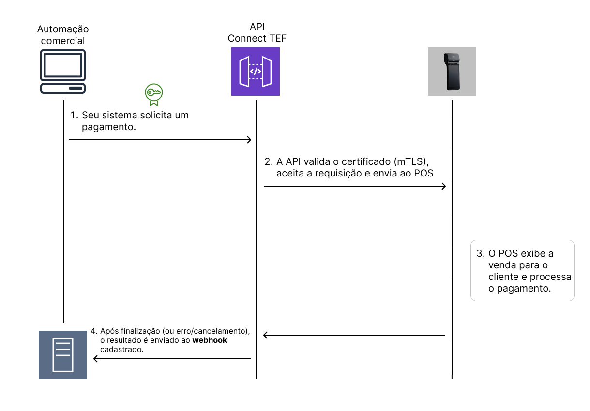

# Pagamento

Este endpoint inicia uma transação de pagamento no POS vinculado ao PDV.

---

## Fluxo de Pagamento

1. Seu sistema solicita um pagamento.
2. A API valida o certificado (mTLS), aceita a requisição e envia ao POS
3. O POS exibe a venda para o cliente e processa o pagamento.
4. Após finalização (ou erro/cancelamento), o resultado é enviado ao **webhook** cadastrado.



---

## Requisição

**Método:** `POST`
**Endpoint:**

```http
https://apitef.pdvpos.com.br/api/v1/web-service/pagamento
```

### **Headers**

| Header       | Obrigatório | Valor              |
|--------------|-------------|--------------------|
| Content-Type | Sim         | `application/json` |

### **Query Params**

| Parâmetro     | Obrigatório | Descrição                                       |
|---------------|-------------|-------------------------------------------------|
| `numeroSerie` | Sim         | Identificador únido da automação (ex: caixa001) |
| `CPFCNPJ`     | Sim         | Obtido na vinculação no campo `CPFCNPJ`         |

### **Body Params**

| Campo                | Tipo     | Obrigatório | Padrão  | Descrição                                                              |
|----------------------|----------|-------------|---------|------------------------------------------------------------------------|
| identificacao        | `string` | Sim (todas) | -       | Identificador único da transação                                       |
| callbackUrl          | `string` | Sim (todas) | -       | URL de retorno para notificações via webhook                           |
| callbackToken        | `string` | Não         | -       | Token enviado no header `token` do webhook                             |
| imprimirComprovante  | `bool`   | Não         | `false` | Se `true`, imprime o comprovante no Smart POS                          |
| naoExecutar          | `bool`   | Não         | `false` | Se `true`, adiciona à lista de cobranças pendentes do Smart POS        |
| uuidTerminal         | `string` | Não         | -       | UUID do terminal para direcionar a solicitação                         |
| textoEspecialCliente | `string` | Não         | -       | Texto exibido no Smart POS ao usar `naoExecutar: true`                 |
| valorTotal           | `number` | Não         | `0.00`  | Valor total da transação                                               |
| quantidadeParcelas   | `number` | Não         | `1`     | Quantidade de parcelas (para vendas a crédito)                         |
| tipoTransacao        | `number` | Não         | -       | Código do tipo de transação (veja tabela abaixo)                       |
| comanda              | `json`   | Não         | -       | Informações adicionais a serem exibidas no Smart POS (detalhes abaixo) |

### **Códigos para `tipoTransacao`**

| Código | Tipo de Transação                      |
|--------|----------------------------------------|
| 10     | Cartão de Crédito à Vista              |
| 11     | Crédito Parcelado pelo Estabelecimento |
| 12     | Crédito Parcelado pela Administradora  |
| 20     | Cartão de Débito                       |
| 30     | PIX / Carteira Digital                 |
| 60     | Voucher / PAT                          |
| 99     | Outras                                 |

Json `comanda`:

```json
{
  "identificador": "Ismael Almeida",
  "itens": [
    {
      "titulo": "Coca cola",
      "descrição": "Bem gelada"
    }
  ],
  "endereco": "R. Humberto I, 1005 - Vila Mariana"
}
```

### **Exemplo de chamada**

```http
POST https://apitef.pdvpos.com.br/api/v1/web-service/pagamento?numeroSerie=caixa001&CPFCNPJ=42580012000182
```

Body Params:

```json
[
  {
    "identificacao": "abc123",
    "tipoTransacao": 10,
    "quantidadeParcelas": 1,
    "valorTotal": 29.90,
    "imprimirComprovante": true,
    "callbackUrl": "https://webhook.com.br/response",
    "callbackToken": "abc1234",
    "naoExecutar": true,
    "comanda": {
      "identificador": "Ismael Almeida",
      "itens": [
        {
          "titulo": "Coca cola",
          "descrição": "Bem gelada"
        }
      ],
      "endereco": "R. Humberto I, 1005 - Vila Mariana"
    }
  }
]
```

---

## Resposta imediata (síncrona)

```json
{
  "status": "transacao_enviada",
  "mensagem": "Transação enviada ao POS",
  "referencia": "abc123"
}
```

---

## Webhook Recebido após finalização

A resposta completa da transação será enviada para o `webhook` informado:

**Headers:**

```
token: abc1234
```

```json
{
  "bandeiraCartao": "VISA",
  "cnpj": "00.000.000/0000-00",
  "codigoAutorizacaoTransacao": "000000",
  "dataTransacaoComprovante": "14052025",
  "executada": true,
  "finalizacao": "000000|000000|000000",
  "horaTransacaoComprovante": "133836",
  "identificacao": "abc123",
  "nomeRede": "STONE",
  "numeroTransacao": "000000",
  "quantidadeParcelas": "1",
  "razaoSocial": "Loja X",
  "statusTransacao": "0",
  "timestampTransacaoHost": "1405133836",
  "tipoTransacao": "10",
  "valorTotal": "11.00"
}
```

---

## Interpretação dos campos principais

| Campo                        | Tipo     | Descrição                                                                      |
|------------------------------|----------|--------------------------------------------------------------------------------|
| `executada`                  | boolean  | `true` se a transação foi executada no POS (independente do resultado)         |
| `statusTransacao`            | string   | `"0"` = sucesso<br/>Qualquer outro valor = falha (ver `textoEspecialOperador`) |
| `textoEspecialOperador`      | string   | Contém a causa do erro, se houver                                              |
| `identificacao`              | `string` | Identificador único da transação                                               |
| `bandeiraCartao`             | `string` | Bandeira do cartão utilizado (ex: VISA, MASTERCARD)                            |
| `cnpj`                       | `string` | CNPJ do estabelecimento vinculado ao POS                                       |
| `codigoAutorizacaoTransacao` | `string` | Código de autorização da adquirente                                            |
| `dataTransacaoComprovante`   | `string` | Data da transação (formato: `ddMMyyyy`)                                        |
| `horaTransacaoComprovante`   | `string` | Hora da transação (formato: `hhmmss`)                                          |
| `nomeRede`                   | `string` | Nome da rede adquirente (ex: STONE, CIELO)                                     |
| `numeroTransacao`            | `string` | Número único da transação fornecido pela adquirente                            |
| `razaoSocial`                | `string` | Nome do estabelecimento no POS                                                 |
| `timestampTransacaoHost`     | `string` | Timestamp da transação no host/processadora                                    |

---

### ✅ Exemplo de sucesso

```json
"executada": true,
"statusTransacao": "0",
"textoEspecialOperador": "Transação aprovada"
```

### ❌ Exemplo de falha

```json
"executada": true,
"statusTransacao": "1001",
"textoEspecialOperador": "Cartão inválido"
```

---

## ▶️ Próximos passos

Agora que você já entendeu o funcionamento o pagamento, acesse o próximo tópico.