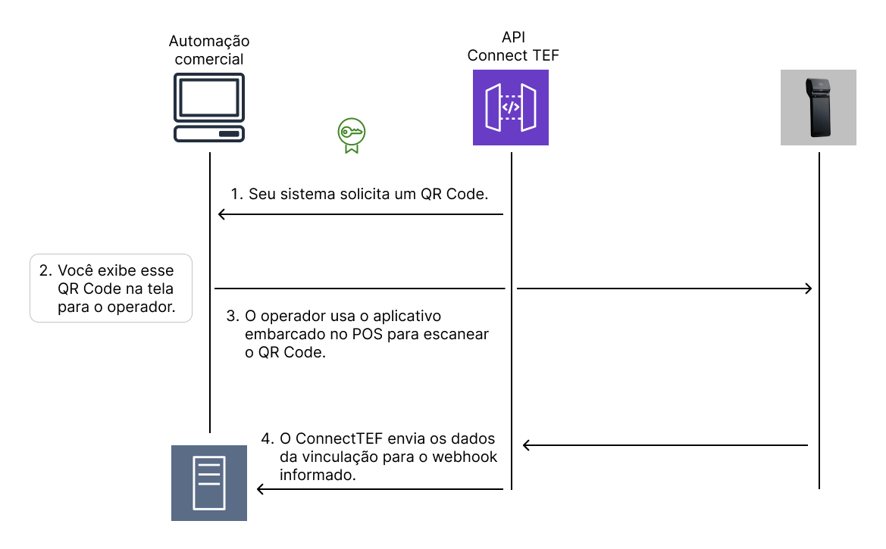

# Vinculação

Antes de qualquer transação, o POS precisa estar vinculado a um ponto de venda (PDV ou sistema ERP). Esse processo associa o POS ao sistema e define o webhook que receberá os eventos.

---

## Fluxo de Vinculação

1. Seu sistema solicita um QR Code.
2. Você exibe esse QR Code na tela para o operador.
3. O operador usa o aplicativo embarcado no POS para escanear o QR Code.
4. O ConnectTEF envia os dados da vinculação para o webhook informado.



---

## Requisição

**Método:** `GET`
**Endpoint:**

```http
https://apitef.pdvpos.com.br/api/v1/web-service/qrcode
```

**Query Params:**

| Parâmetro       | Obrigatório | Descrição                                              |
| --------------- | ----------- |--------------------------------------------------------|
| `numeroSerie`   | Sim         | Identificador únido da automação (ex: `caixa001`)      |
| `callbackUrl`   | Sim         | URL do seu webhook que receberá os dados da vinculação |
| `callbackToken` | Não         | Token que será enviado no header `token` do webhook    |

**Exemplo de chamada:**

```http
GET https://apitef.pdvpos.com.br/api/v1/web-service/qrcode?numeroSerie=caixa001&callbackUrl=https://webhook.com.br/response&callbackToken=abc1234
```

---

## Resposta de Sucesso

```json
{
  "qrCode": "9512aad025a1ae..."
}
```

> Basta criar um QR Code a partir do campo `qrCode` e exibir na tela para que o POS possa escanear.

---

## Webhook Recebido após leitura

Após o POS escanear o QR Code com sucesso, o ConnectTEF envia para o `callbackUrl` informado:

```json
{
  "uuidTerminal": "abc123",
  "rede": "Mercado Pago",
  "numeroSerieTerminal": "abc123",
  "ipLocal": "192.168.0.25",
  "macAddress": "74:F7:F...",
  "cnpjEmpresa": "42580012000182"
}
```

**Headers:**

```
token: abc1234
```

---

## 🔒 Regras Importantes

* Toda requisição futura **deve usar o mesmo `cpf` ou `cnpj` (obtido na vinculação)** e o `numeroSerie` utilizado na requisição do QR Code.
* Um POS pode ser atribuído a vários PDVs.
* Um PDV pode ser atribuído a vários POSs.
* O token é opcional, mas fortemente recomendado para validar as chamadas recebidas.

---

## ▶️ Próximos passos

Agora que você já entendeu o funcionamento a vinculação, acesse o próximo tópico.
