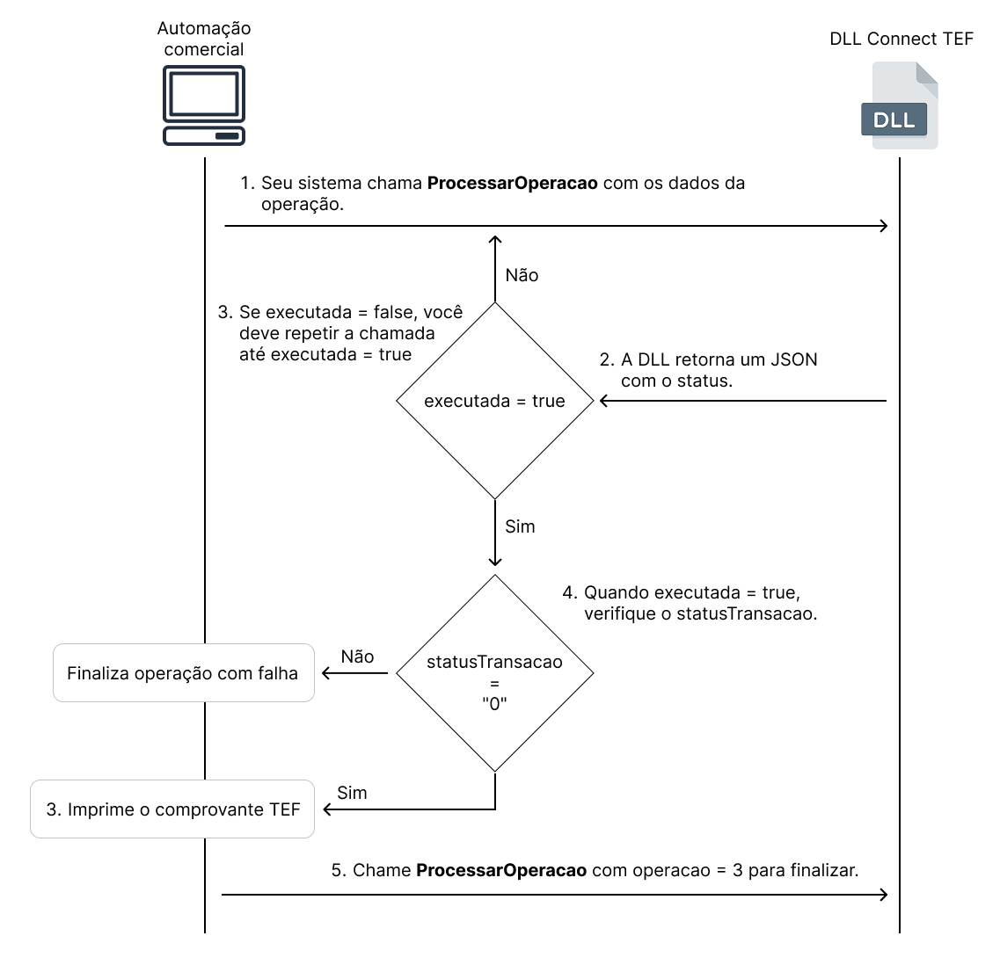

# Introdução

A `InterfaceConnectTEF.dll` é uma biblioteca que permite a integração de aplicações windows ao Connect TEF, oferecendo suporte a **transações**, **estornos**, **impressão**.

> ⚠️ **Importante:**  
> A DLL se comunica com o **Gerenciador Padrão**, que deve estar corretamente instalado e configurado no ambiente.  
> Antes de iniciar a integração, consulte o [***Guia de Ativação clicando aqui***](../../guia-ativacao/windows.md).

---

## Downloads

| Item                 | Descrição                        | Link para Download                                                                                        |
|----------------------|----------------------------------|-----------------------------------------------------------------------------------------------------------|
| DLL ConnectTEF x86   | Biblioteca para sistemas 32 bits | [Download DLL x86](https://arquivos.pdvpos.com.br/connecttef/gerenciador-padrao/dll/InterfaceConnectTEF-Win32.dll)   |
| DLL ConnectTEF x64   | Biblioteca para sistemas 64 bits | [Download DLL x64](https://arquivos.pdvpos.com.br/connecttef/gerenciador-padrao/dll/InterfaceConnectTEF-Win32.dll)   |
| DLL ConnectTEF Win32 | Biblioteca para sistemas Win32   | [Download DLL Win32](https://arquivos.pdvpos.com.br/connecttef/gerenciador-padrao/dll/InterfaceConnectTEF-Win32.dll) |

---

## Visão Geral

O fluxo de qualquer operação segue este padrão:

1. Seu sistema chama `ProcessarOperacao` com os dados da operação.
2. A DLL retorna um JSON com o status.
3. Se `executada = false`, repita a chamada com `novaOperacao = false` até `executada = true`.
4. Se `executada = true`, verifique `statusTransacao`.
5. Se `statusTransacao = "0"`, chame `ProcessarOperacao` com `operacao = 3` para finalizar.



---

## Assinatura da Função

```c
char* ProcessarOperacao(int operacao, const char* payload, bool novaOperacao);
````

### Parâmetros

| Parâmetro      | Tipo          | Descrição                                                                                         |
|----------------|---------------|---------------------------------------------------------------------------------------------------|
| `operacao`     | `int`         | Tipo de operação:<br/>`0` = Pagamento<br/>`1` = Estorno<br/>`2` = Impressão<br/>`3` = Finalização |
| `payload`      | `const char*` | String JSON com os dados da operação                                                              |
| `novaOperacao` | `bool`        | `true` para nova operação<br/>`false` para continuar uma operação em andamento                    |

## Campos no JSON de retorno

| Campo                         | Tipo    | Descrição                                              |
|-------------------------------|---------|--------------------------------------------------------|
| `identificacao`               | string  | Identificador único da operação                        |
| `valorTotal`                  | string  | Valor total da transação                               |
| `statusTransacao`             | string  | "0" = sucesso; outros valores indicam falha            |
| `nomeRede`                    | string  | Nome da adquirente                                     |
| `tipoTransacao`               | string  | Tipo da transação                                      |
| `numeroTransacao`             | string  | Número sequencial da transação                         |
| `codigoAutorizacaoTransacao`  | string  | Código de autorização fornecido pela adquirente        |
| `quantidadeParcelas`          | string  | Número de parcelas                                     |
| `dataTransacaoComprovante`    | string  | Data da transação no comprovante (formato: ddMMyyyy)   |
| `horaTransacaoComprovante`    | string  | Hora da transação no comprovante (formato: hhmmss)     |
| `numeroTransacaoCancelada`    | string  | Número da transação que foi cancelada                  |
| `timestampTransacaoCancelada` | string  | Timestamp da transação cancelada (formato: ddMMhhmmss) |
| `finalizacao`                 | string  | Dados técnicos da finalização da transação             |
| `quantidadeLinhasComprovante` | string  | Quantidade de linhas no comprovante                    |
| `textoEspecialOperador`       | string  | Mensagem especial para exibição ao operador            |
| `numeroSerieTerminal`         | string  | Número de série do terminal (Smart POS)                |
| `executada`                   | boolean | Indica se a operação foi processada com sucesso        |
| `cnpj`                        | string  | CNPJ do estabelecimento                                |
| `bandeiraCartao`              | string  | Bandeira do cartão utilizado (ex: MASTERCARD)          |

---

## Exemplos de Resposta

### ⏳ Em Andamento

```json
{
  "executada": false,
  "textoEspecialOperador": "PROCESSANDO..."
}
```

### ❌ Exemplo com Falha

```json
{
  "executada": true,
  "statusTransacao": "1001",
  "textoEspecialOperador": "Cartão inválido"
}
```

### ✅ Exemplo com Sucesso

```json
{
  "identificacao" : "1",
  "valorTotal" : "100",
  "statusTransacao" : "0",
  "nomeRede" : "PINBANK",
  "tipoTransacao" : "10",
  "numeroTransacao" : "92",
  "codigoAutorizacaoTransacao" : "359390",
  "quantidadeParcelas" : "1",
  "dataTransacaoComprovante" : "14072025",
  "horaTransacaoComprovante" : "162602",
  "numeroTransacaoCancelada" : "92",
  "timestampTransacaoCancelada" : "1407162602",
  "finalizacao" : "2117085|359390|359390",
  "quantidadeLinhasComprovante" : "000",
  "textoEspecialOperador" : "Transação cancelada com sucesso!",
  "numeroSerieTerminal" : "PBF923CC70331",
  "executada" : false,
  "cnpj" : "42407441000152",
  "bandeiraCartao" : "MASTERCARD"
}
```