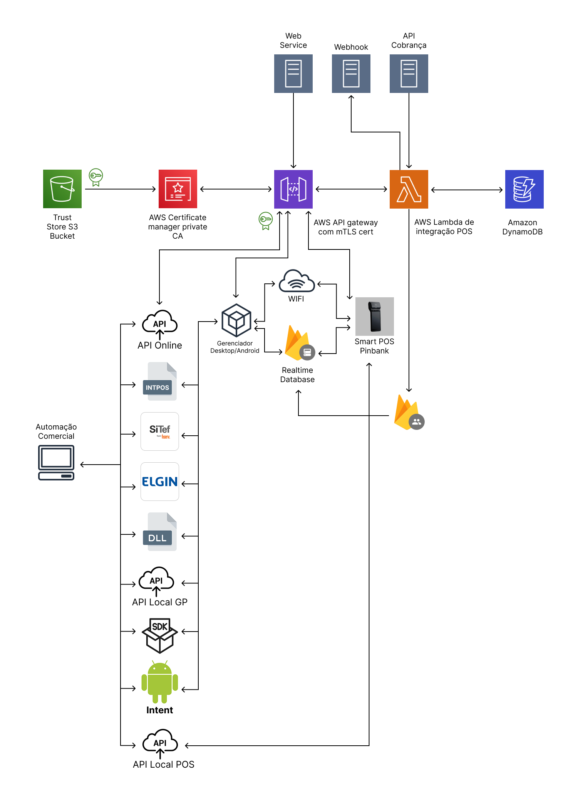

# Introdução

Com apenas uma integração, seu sistema se conecta a **diversas adquirentes e capturadoras**, eliminando a necessidade de múltiplas homologações e reduzindo o tempo de implantação.

**✔️ Menos complexidade, mais agilidade**  
Integre uma vez e atenda várias adquirentes sem precisar de novas homologações.

**✔️ Redução de custos e tempo de implantação**  
Evite retrabalhos e acelere o onboarding de novos clientes.

**✔️ Escalabilidade garantida**  
Adicione novos terminais ou adquirentes facilmente, sem alterar o código-base.

**✔️ Operação estável e segura**  
Com alta disponibilidade e monitoramento contínuo, o Connect TEF garante confiabilidade nas transações.

**✔️ Foco no seu produto**  
Enquanto o Connect TEF cuida do pagamento, sua equipe foca em entregar valor, experiência e inovação.

---

## Arquitetura e Escalabilidade

O **Connect TEF** foi projetado sobre uma arquitetura **serverless** e **altamente escalável**, capaz de processar milhares de transações simultâneas com **baixa latência** e **alta disponibilidade**.

Essa arquitetura elimina a necessidade de servidores dedicados, reduz custos operacionais e garante performance consistente mesmo em períodos de pico.

---

## ☁️ Visão Geral da Arquitetura

---

## 🔒 Segurança

Toda comunicação entre os componentes (APIs, terminais e nuvem) é protegida por:
- Certificados digitais emitidos via **AWS Certificate Manager (Private CA)**  
- **mTLS (mutual TLS)** para autenticação bidirecional  

---

## 📱 Compatibilidade de Terminais

A tabela abaixo mostra os **modelos de terminais SmartPOS compatíveis** com as **adquirentes suportadas** pelo Connect TEF:

| Adquirentes / Sub | Modelos Compatíveis                                  |
| ----------------- | ---------------------------------------------------- |
| **Stone**         | Positivo (L400, L300), APOS A8, P2, T8               |
| **Cielo**         | DX8000, L300, L400                                   |
| **Rede**          | L400                                                 |
| **GetNet**        | APOS A8 , N910, P2, P3, DX8000                       |
| **Interpag**      | Interpag N910                                        |
| **Vero**          | P2, L300, L300, A11, N950 e N950K                    |
| **PagSeguro**     | GPOS780, P2, PAX A930, PAX A50, PAX SK800            |
| **Mercado Pago**  | A910, N950                                           |
| **Sicredi**       | DX8000, P2                                           |
| **Caixa**         | DX8000, P2                                           |
| **Bin**           | DX8000, P2                                           |
| **Ceopag**        | P2, L300, PAX (D150, D180, A920, A910, A77, A920Pro) |
| **Entrepay**      | P2, L300, PAX (D150, D180, A920, A910, A77, A920Pro) |
| **Adiq**          | P2, L300, PAX (D150, D180, A920, A910, A77, A920Pro) |
| **Fiserv**        | DX8000, P2                                           |
| **Phoebus**       | P2, L300, PAX (D150, D180, A920, A910, A77, A920Pro) |
| **Pinbank**       | P2, A910, A920                                       |
| **Dock**          | DX8000                                               |
| **BRB**           | P2                                                   |
| **C6**            | P3                                                   |
| **PicPay**        | Andamento...                                         |
| **Sicoob**        | Andamento...                                         |
| **Safra Pay**     | Andamento...                                         |

---

Saiba mais em https://www.connecttef.com.br